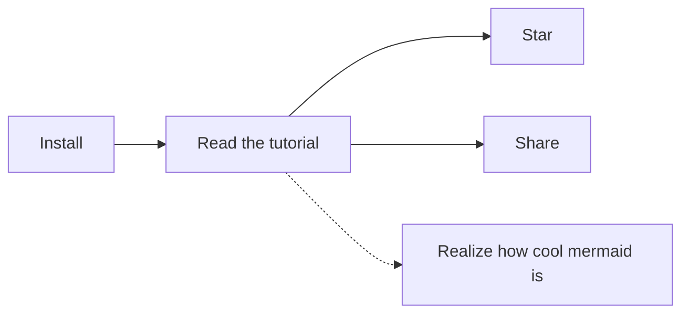

# Aide
[Plus d'infos](@https://guides.github.com/features/mastering-markdown/)

## Titres

```
Encadrement d'un texte
```

`Encadrement d'un mot`

[redirection](@google.com)

Bold : **test**
Italique : *italique*

## Unordered list
- list 1
- list 2
  - list 3

:joy:

> **Note** : This is a test

- <kbd>Cmd+N</kbd> - New.

[test](http://www.test.com)

[Shortcuts](./note/07 - Shortcuts.md)
[](./note/07 - Shortcuts.md)
[[Importing|08 - Importing.md]]
[[08 - Importing]]


[Icon](./attachment/icon_small.png)
[](./attachment/icon_small.png)


