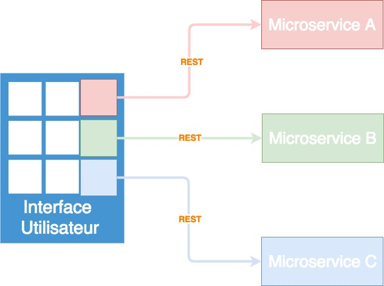

Source : https://ewanvalentine.io/microservices-in-golang-part-1/

# Introduction
source : https://www.nginx.com/blog/introduction-to-microservices/

Avec l'essor des applications gourmandes en ressources (streaming vidéo, musique, e-commerce), les entreprises sont confrontées à des challenges liés à la performance des services, du coût de l'infrastructure technique et du coût de développement et maintenance.

En effet, de nos jours une application doit :
- Toujours être disponible et sans ralentissement quelle que soit l'affluence des utilisateurs
Pour cela, il faut que l'application soit scalable c'est à dire capable de s'étendre sur plus de ressources (plus de serveurs, de disques durs, de bases de données) tout en gardant une parfaite consistance dans ses données et une cohérence dans son comportement.
- Etre capable d'évoluer très rapidement
Il faut être capable de faire des mises à jours qui visent des composants ciblés, très rapidement, de façon fiable et sans se soucier des éventuelles conséquences sur le reste de l'application.
- Etre modulable
Les technologies utilisées évoluent très vite et les nouveautés offrent parfois des avantages énormes.
Ex : Une entreprise qui permet de placer des transactions sur les marchés boursier. L'application repose sur un algorithme écrit en Java. Or un jour, NodeJS apparait et permet de multiplier la vitesse par 2 de cet algorithme. Si l'entreprise ne s'adapte pas, elle perdra des clients car elle sera dépassée par la concurrence. Il faut donc que l'entreprise dispose d'une architecture qui lui permette de passer d'une technologie à l'autre sur des portions individuelles de son application.

C'est ainsi que l'architecture Microservices est apparue et permet d'obtenir des applications "Cloud-native".
# Principe
Le microservices consiste à découper une application en petits services parfaitement autonomes qui exposent une API REST que les autres microservices pourront consommer.

La figure représente un schéma simplifié d'une application basée sur l'architecture microservices.
Cette application affiche par exemple un produit à vendre. Cette fiche produit est consistuée d'une photo, d'un descriptif et d'un prix.
Dans le schéma l'interface utilisateur fait appel à un Microservice pour chaque composant à renseigner. Ainsi, celle-ci peut faire une requête REST aux microservices.
Dans cet exemple l'interface utilisateur est également un microservice s'occupant de rassembler les informations et de la servir à l'utilisateur final.

# Protobuf / gRPC

Comme les microservices sont séparés dans plusieurs bases de code, l'un des aspects les plus importants sera la communication.
En effet, dans une application monolithe, la communication n'est pas un problème puisque le code peut en appeler un autre étant donné qu'ils vivent dans la même base de code.

Il est possible ici d'utiliser l'architecture REST avec un format de données tel que JSON ou XML à travers http. Cependant, il existe quelques problèmes avec cette méthode :
- Il faut encoder et décoder le message à chaque communication.

Il est bien évidemment obligatoire d'utiliser cela avec les navigateurs cependant les services peuvent utiliser n'importe quel format.

gRPC est un protocole de communication utilisant des binaires comme format de données. (dans le cas de JSON, il s'agit d'un string over http). Les strings contiennent des méta-données sur le format d'encodage, de la longueur, etc ... Cela a été fait dans le but d'informer les navigateurs à quoi s'attendre?
Dans notre cas, nous n'avons pas besoin de cela donc nous pouvons utiliser des données binaires.
Pour exploiter ces données binaires, nous allons utiliser un protobuf. Un protobuf pemet de définir une interface au service.

# Commandes