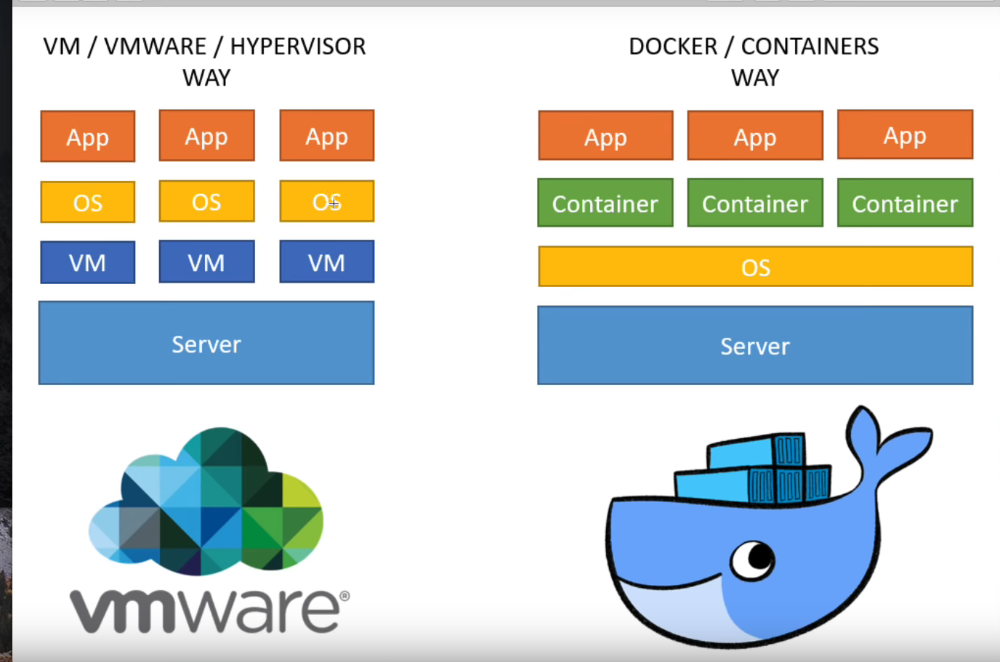

# 01- Introduction à Docker
## Plus de commandes 
https://gist.github.com/bradtraversy/89fad226dc058a41b596d586022a9bd3
## Introduction
Docker permet de lancer des softwares/applications dans des containers.
Cela peut aller de nginx (serveur web) à mongoDB, mySQL, DRUPAL, ...
Docker enveloppe l'application et ses dépendances dans une unité incluant le code, runtime, librairies.
### Comparaison Docker vs VM

#### Docker :
##### Avantages :
- Facile à déployer, il suffit de packager une image et de créer un container
- Rapide à déployer étant donné qu'ils ne contiennent aucune donnée sur l'OS
- Rapide à lancer
- L'application tournera de la même façon à chaque installation
- Les machines ayant docker disposent d'un seul OS et de plusieurs containers(processes) partageant cet OS (kernel), cela permet d'alléger la quantité de machine à avoir.
- Permet également de s'afranchir des problèmes de compatibilité entre les OS (ex: développement d'une app sur windows puis déploiement sur une machine linux) car on sélectionne l'OS sur lequel tourne le container.

#### VM :
Les VM sont une abstraction d'une machine physique permettant de convertir un simple serveur (physique) en de multiples serveurs(virtualisés).
L'hyperviseur permet à de multiples VM de tourner sur une seule machine.
Chaque VM dispose de son propre OS.
##### Désavantages :
- Chaque VM dispose de son propre OS 
- Lent à démarrer (Besoin de monter un OS et l'app)

### Définitions
- Images -> Correspond au programme (nginx, mySQL, ..)
- Container -> Correspond à l'instanciation d'une image

Analogie : Une image correspond au plan de la maison tandis qu'un container correspond à la maison.
## Description
Docker est composé d'un client et d'un serveur (engine)
## Commandes
https://gist.github.com/bradtraversy/89fad226dc058a41b596d586022a9bd3
### Installation
https://www.digitalocean.com/community/tutorials/how-to-install-and-use-docker-on-ubuntu-18-04
### Principales commandes
- `docker`
- `docker container ls` / `docker ps -a`: Montre les instances actuelles
- `docker images` : Permet de visualiser toutes les images disponibles sur la machine
#### Lancer un container
- `docker container run -d -p 8080:80 --name myapache httpd`
  - `-d`: detached permet de lancer le container en background
  - `httpd` : nom de l'image
  - `-p`: port number, le 1er port est celui de la machine locale, le 2nd est celui du programme (80 pour nginx)
- `docker container run -d -p 3306:3306 --name mysql --env MYSQL_ROOT_PASSWORD=123456 mysql` : permet de créer un container sur le port 3306 avec une variable d'environnement configurée (MYSQL_ROOT_PASSWORD)
#### Supprimer un container/image
- `docker container stop mysql`: permet de stopper le container
- `docker container rm 09a` : permet de supprimer un container arrêté (09a correspond au début de l'ID du container)
- `docker container rm -f myapache` / `docker rm -f myapache` : permet de supprimer un container
  - `-f` est nécessaire lorsque le container est en marche.
- `docker rm $(docker ps -aq) -f`: permet de supprimer tous les containers
- `docker image rm 09a` : permet de supprimer une image (09a correspond au début de l'ID de l'image)
#### Enter into container
- `docker container exec -it mynginx bash`
  - `-it` : interactive mode (inverse de -d) permet de montrer toutes les interactions avec le serveur dans le bash
- `exit` pour sortir du container
#### How to edit files
1. Se placer dans le repo contenant les dossiers voulus puis saisir :
`docker container run -d -p 8080:80 -v $(pwd):/usr/share/nginx/html --name nginx-website nginx`
- `-v`: Cette commande permet de créer un bind mount entre la machine locale (`$(pwd)` représente le dossier dans lequel on se situe) et le container (dans le dossier /usr/share/nginx/html).
2. Créer un fichier HTML dans le repo actuel (machine locale)
3. Aller sur `localhost:8080`
### Créer une docker file pour créer une image d'une application
1. Créer un nouveau fichier : `Dockerfile`
2. Saisir dans le fichier :
```
FROM nginx:latest //Configuration de l'environnement de l'image

WORKDIR /usr/share/nginx/html

COPY . . //copy all files to the image (/usr/share/nginx/html)
```
3. Construire l'image :
`docker image build -t btravery/nginx-website .`
- `.` Sélectionne le dockerfile de notre dossier
4. (Optionnel) Envoyer l'image sur dockerhub afin qu'elle soit accessible partout dans le monde
`docker push btraversy/nginx-website` : Push une image sur dockerhub 
Si problème de connexion, utiliser `docker login`

## Images
Pour trouver les images, il faut se rendre sur https://hub.docker.com/. Ce site répértorie l'ensemble des images publiées
- `nginx web server` (ressemble à Apache)


