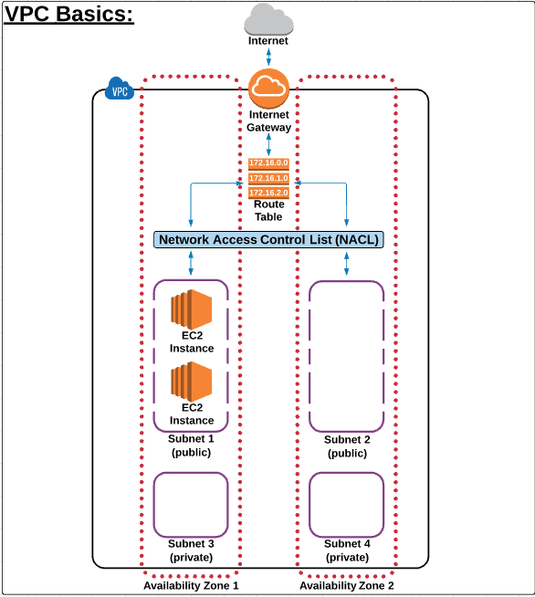
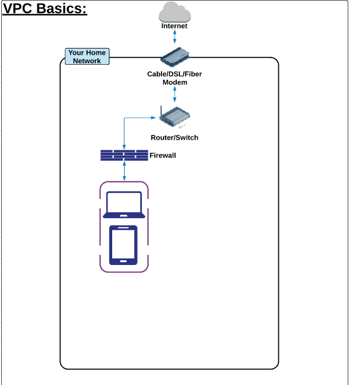

# AWS

## Introduction

## Services

### IAM

#### Introduction

IAM permet de manager les accès aux services AWS des utilisateurs et des services AWS via la création de users, groupes et rôles son propre VPC.
Pour affecter des droits d'accès, il faut attribuer des policies (S3 full access, admin, ...).

Roles : Représente les accès possibles d'un service AWS vers un autre servi ce AWS (ex: EC2 => S3)

### VPC (virtual private cloud)

#### Introduction

Un VPC est une partie d'AWS dans laquelle nous pouvons ajouter des services AWS.

Un VPC ressemble à un réseau privé d'accès à internet :

un VPC dispose de plusieurs composants décris ci-dessous.

##### Internet Gateway (IGW)

Il s'agit d'une combination de hardware et software donnant accès à internet via une route à notre VPC.

##### Route tables

Une route table contient une liste de règles (appelées routes) définissant vers quelle service AWS le traffic va être dirigé.

##### Network Access Control List (NACL)

Il s'agit d'un firewall disposant de règles d'accès aux subnets.

##### Subnets

Permet d'avoir des sous-réseaux composés de services AWS

##### Availability zones

Il s'agit de datacenters distincts designés pour être totalement isolés en cas de failures et ainsi toujours avoir un datacenter disponible.
Lorsque l'on crée un projet, pour faire en sorte que le système soit résilient, il faut impérativement utiliser plusieurs availability zones pour créer de la redondance dans l'architecture et ainsi avoir un système hautement disponible et résilient

### S3 (Simple storage service)

#### Introduction

S3 dispose d'un WS permettant de stocker, récupérer n'importe quelles données.

#### Définition des composants

Buckets : Root level folder  
Folder : Subfolder
Objects : Fichiers stockés
Storage classes : standard/Glacier/ ...
Object lifecycles : Permet d'automatiser la transformation d'un objet d'une classe à une autre selon un délai fixé.
Permissions : Qui peut voir / modifier le bucket ou les objets. De plus, il est possible de rendre public l'accès à un object afin que n'importe qui disposant de l'url puisse le visualiser/télécharger.
Object versionning : Permet de garder l'historique des documents. Bucket level, apply to all objects

### EC2 (Elastic Cloud Compute)

#### Introduction

EC2 est un service mettant à disposition des serveurs virtuels.

Composants d'une instance EC2 :

- AMI (OS) : Il s'agit d'un package comprenant l'OS, des softwares packages et quelques paramètres) qui seront installés au lancement de l'instance.
- Instance type (CPU) : Définit le hardware utilisé par notre instance : nombre de CPU, RAM, memory, bandwidth capacity
- EBS (Elastic Block Store) : Hard drive
  - IOPS : Unité représentant le nombre d'opération d'écriture ou de lecture par seconde
- Security groups (firewall) : Représente une sécurité en plus des NACL (network acess control list)
- Ip adressing (network card) : Permet de définir une adresse IP pour une instance donnée. Par défaut, les instances disposent d'une adresse privée permettant de communiquer à l'intérieur du VPC. Cependant, pour communiquer avec internet, il faut obligatoirement une adresse IP publique.
- RAM

### RDS/DynamoDB

RDS (SQL) : Il s'agit d'un service mettant à disposition en SaaS des DB SQL telles que MySQL, MariaDB, Oracle,...
DynamoDB : NOSQL

### SNS (Simple notification service)

### CloudWatch

### ELB (Elastic load balancing)

### Auto Scaling

### Route 53

### Lambda
