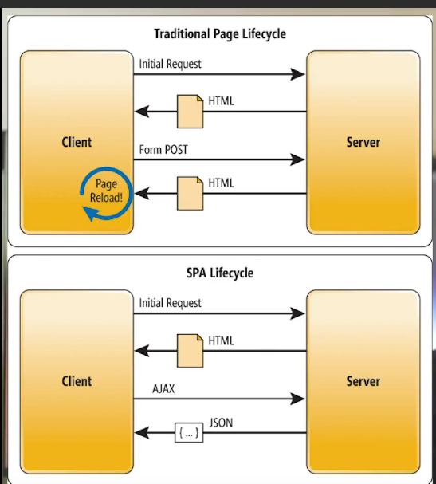

# CSR (Client side rendering) vs SSR

La différence entre les 2 réside dans le fait que d'un côté le javascript est executé côté client (risque que le navigateur client n'accepte pas d'exécuter le code JS / risque de lenteur car dépendant de l'ordi client), de l'autre le code JS est exécuté côté serveur puis l'ensemble de la page HTML est envoyé au client.

Critères permettant de choisir entre les deux :

- SEO : Avantage SSR
- Performance :
  - Initial Page Load : Avantage SSR
  - Par la suite : Avantage SPA car tous les assets sont téléchargés
- Population :
  - Mobile : Avantage SSR

Traditionnellement, le client réalise une requête auprès d'un serveur et reçoit le HTML rempli avec les données nécessaires.
Avec les SPA cependant, le serveur envoie l'ensemble des fichiers nécessaires puis le client réalise des requêtes AJAX et reçoit du JSON qui est ensuite affiché à l'écran.

Architecture :

- Home / About / Pricing / ... : SSR (website.com)
- Application : SPA (app.website.com)

# SPA

Les raisons pour ne pas choisir de SPA :

- Besoin de délivrer rapidement du contenu.
