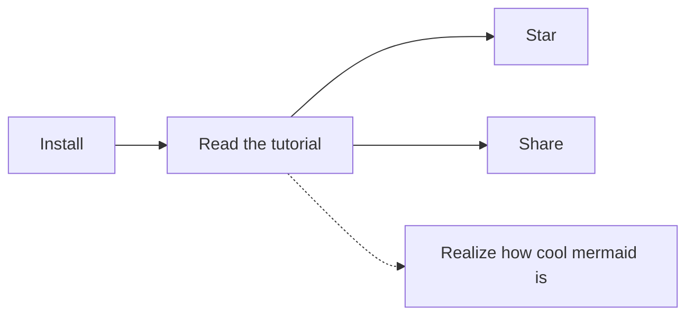

# Aide
[Plus d'infos](@https://guides.github.com/features/mastering-markdown/)

## Comment intégrer du MD dans un fichier HTML ?
1. First install the marked markdown converter:

`$ npm install --save-dev marked`

2. Then in a new file called generateReadMe.js, compile the markdown to HTML and write it to a new README.html file:
```
var marked = require('marked');
var fs = require('fs');

var readMe = fs.readFileSync('README.md', 'utf-8');
var markdownReadMe = marked(readMe);

fs.writeFileSync('./site/README.html', markdownReadMe);
```
3. Then inside the index.html where the README.md content is wanted, add an `<object>` tag:

`<object data="README.html" type="text/html"></object>`

4. Then run this on the command line to make it happen:

`$ node path/to/generateReadMe.js`

The whole process was pretty simple and painless. I added the whole thing to my npm start script. Now any time I make a change to my README.md file, the changes will register on my gh-pages website.


## Titres

```
Encadrement d'un texte
```

`Encadrement d'un mot`

[redirection](@google.com)

Bold : **test**
Italique : *italique*

## Unordered list
- list 1
- list 2

:joy:

> **Note** : This is a test

~~strikethrough~~

- <kbd>Cmd+N</kbd> - New.

[Shortcuts](@note/07 - Shortcuts.md)
[](@note/07 - Shortcuts.md)
[[Importing|08 - Importing.md]]
[[08 - Importing]]


[Icon](@attachment/icon_small.png)
[](@attachment/icon_small.png)



Markdown | Less | Pretty
--- | --- | ---
*Still* | `renders` | **nicely**
1 | 2 | 3

