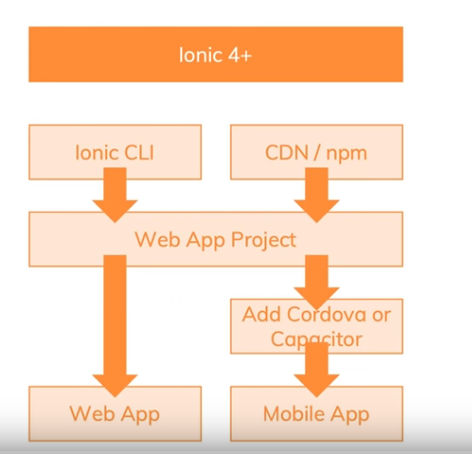

# Ionic 3:21:20
## Introduction 
Ionic est un framework permettant de réaliser des web apps pouvant être converties en PWA ou en native apps.
Pour cela Ionic met à disposition :
- des web components près à l'usage (boutons, ...) [Plus d'infos](https://ionicframework.com/docs/components/)
- des features natives du téléphones

A noter que la CLI Ionic est basé sur angular.

### Workflow

Il existe plusieurs manières de convertir notre web app en native app:
- Compiler le code en java /swift
- Envelopper l'application dans une webview.

#### Webview 
Dans une app native, il est possible de lancer une webview (correspond à un browser affiché en fullscreen) pour afficher une page web (voir reddit/gmail).
Capacitor ou Cordova permettent de mettre en place une coquille vide d'app native contenant une webview. En background un webserver va tourner pour faire marcher ionic sur cette webview.
Cordova et webview permettent également d'accéder aux natives fonctionnalités d'une application (storage/photos/...).

#### Web Components

## Commandes
- Pour créer un projet: ionic start
- Lancer le webserver: ionic serve
- Générer un component: ionic generate

## Building blocks
### Ionic components
#### types of components
##### Output (img, badge, loading, label, title, toast, thumbnail)
##### Layout (grid, list, card, tabs)
Appliquer une propriété sur un écran spécifique: propriété-taille (xs, sm, md, lg)
- exemple: size-md="6". 

La propriété size ne s'appliquera que sur les écrans de taille medium à large (lg).

Centrer une valeur: offset-md="3"
##### Input (button, input, textarea, select)

### Themes & styles
### Navigation
### State management
### Native device features
### CLI
### Convertir la web app
Pour convertir la web app en app native :
https://www.youtube.com/watch?v=r2ga-iXS5i4 : 3h30min

