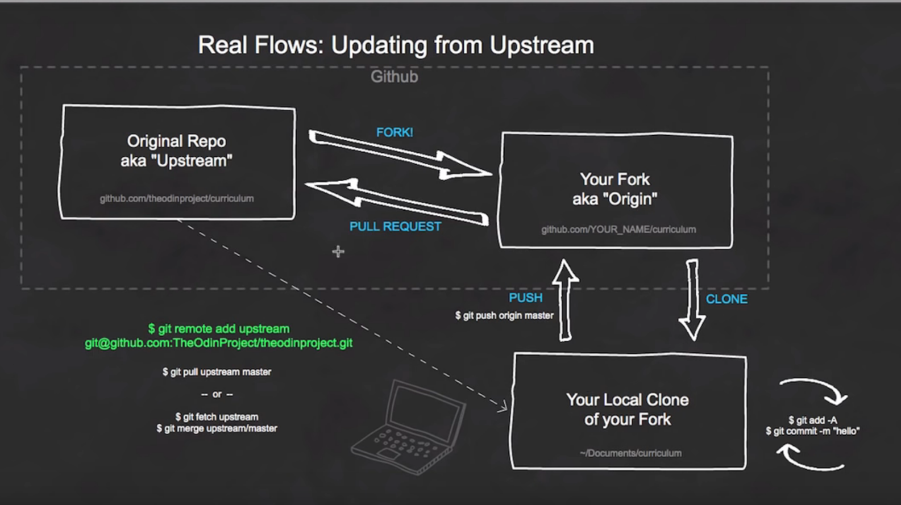

# 05 - Git
## Introduction
Git est un logiciel de versionning.
Il existe 3 environnements :
    • Working directory
    • Staging area
    • Commit area

## workflow
1. Fetch and merge changes from the remote
1. Create a branch to work on a new project feature
1. Develop the feature on your branch and commit your work
1. Fetch and merge from the remote again (in case new commits were made while you were working)
1. Push your branch up to the remote for review
## Commandes
#### Processus de création d’un repo git
1. Se placer dans le repo
1. Saisir `git init`
1. `git add .` (permet de placer les fichiers «unstaged» dans une staging area)
1. `Git commit -m "initial commit"`
#### Déployer sur github
1. `git remote add origin repo’s SSH URL` 
1. `git push -u origin master`
- Retirer un repo de la liste `git remote rm origin`
#### Processus standard
1. `git add nom du fichier`
1. `git commit -m "commentaire"`
1. `git push origin master` (pour push sur github)
Origin est le nom pour remplacer l’url du repo github
## Commandes générales
- Connaitre l’état du repo : `git status`
- Voir l’historique des commit : `git log`
- Voir les différences entre la version stagé et la version actuelle : `git diff nom du fichier`
- Voir la dernière version commitée : `git show HEAD nomDuFichier`
#### Reseting
- Revenir à la dernière version commité et refresh le working directory : `git checkout HEAD nomDuFichier`
- Retirer un fichier de la staging area : `git reset HEAD nomDuFichier`
- Pour revenir à un précédent commit : `git reset 7 premiers chiffres du SHA`
#### Branching
- Savoir sur quel branche on se situe : `git branch` (* montre sur quel branche on se situe)
- Créer une branche : `git branche nomDeLaBranche`
- Se placer sur la branche : `git checkout nomDeLaBranche`
- merge des modifications :
1. Se placer sur le master
1. `merge branch nomDeLaBranche`
> Fusionner des branches est une pratique courante lorsque vous travaillez sur un projet : vous devez toujours chercher à remettre les modifications faites sur vos différentes branches dans la branche principale master.
Si il y a un conflit entre 2 branches ouvrir le fichier et résoudre le conflit : nano nomDuFichier puis l'ajouter :
`git add nomDuFichier` puis commit : `git commit`

- Supprimer une branche (utile une fois que la branche a été mergée dans le master) : `git branch -d nomDeLaBranche`
#### Collaboratif
- Cloner un repo github en local : `git clone repo’s SSH URL` (ou le path) nomDuRepoLocal
- Redescendre les modifications apportées au repo origin sur la branche origin/master (le master local n’est pas à jour): `git fetch`
- Mettre à jour le repo local : `git merge origin/master`
- Pousser sur origin : `git push origin nomDeLaBranche`
Retrouver qui a fait une modification : `git blame nomDuFichier`
Le début du SHA apparait. Pour réaliser une recherche sur ce commit : `git show n° SHA`
#### Autre
- Commit sans avoir à add : `git commit -am "commentaire"` (permet de mettre à jour les fichiers indexés)

#### Ignorer un fichier
1. créer un fichier `.gitignore`
1. Ajouter les noms de fichier à ignorer ligne par ligne en indiquant le chemin complet (ex : config/application.yml)
1. Ajouter et commit

#### Comment faire pour ne pas perdre ses modif en cours avant de passer à un sujet urgent à traiter ?
1. Mettre de côté : `git stash`
1. Se rendre sur la branche à traiter et Régler l'urgence et commit
1. Revenir sur la branche initiale 
1. Récupérer les modifications : `git stash pop`

## Contributing to open source
Processus :
1. Forker le projet source (appelé upstream)
1. Cloner l’origin en local
1. réaliser les modifications
1. Rajouter le repo « upstream » au remote avec la commande : git remote add upstream upstream SSH’s 
1. Partir du postulat qu’à partir du moment où le repo a été cloné, il a été modifié par quelqu’un d’autre. Il faut donc le mettre à jour :
        ◦ 1ère solution : `git pull upstream master` (pull = fetch + merge)
        ◦ 2ème solution :
            1. Récupérer les modifications et ajoute des branches : `git fetch upstream`
            2. `git merge upstream/master`
1. Push la dernière version sur origin
1. Réaliser un pull request
 
    
## Publier un site sur Github Pages
1. Créer un repo avec le nom d'utilisateur.github.io (yousseffarkhani.github.io)
1. Cloner le repo local sur origin
1. Aller à yousseffarkhani.github.io
## Ressources
Bien rédiger ses commits : https://chris.beams.io/posts/git-commit/
## Pour approfondir
https://openclassrooms.com/courses/gerer-son-code-avec-git-et-github
https://www.atlassian.com/git/tutorials

https://www.youtube.com/watch?v=HVsySz-h9r4
https://www.learnenough.com/git-tutorial

