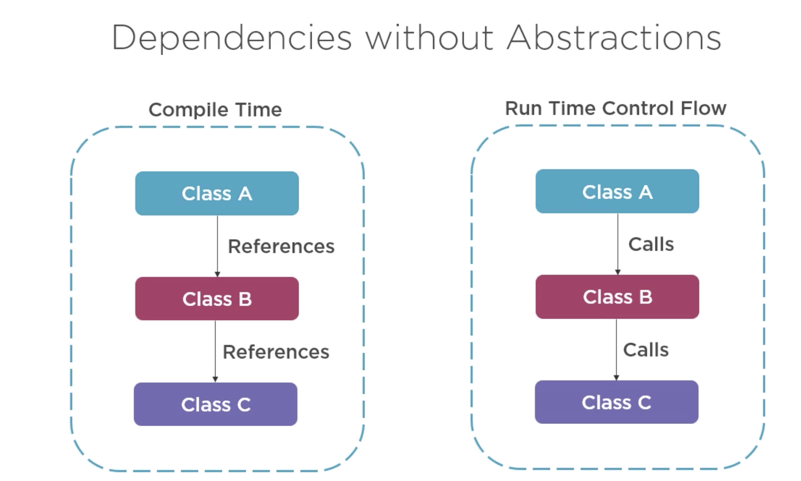
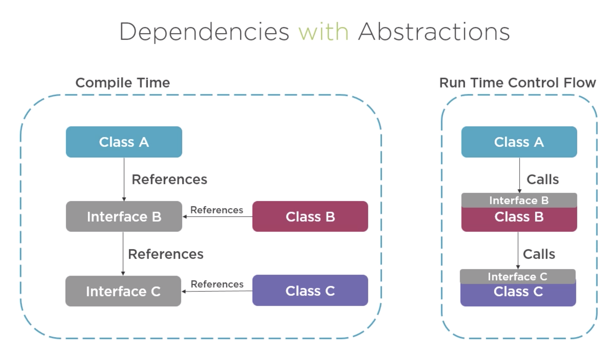

# OOP Principles
5 principes, appelés SOLID Design principles, régissent la programmation orientée objet :
## Single responsibility
Ce principe présente le fait qu’une classe (ou un module ou un objet) ne devrait avoir qu’une seule responsabilité.
Par exemple la logique de l’application devrait être gérée à part, les fonctions de MAJ et d’écriture dans le DOM également.
« Do one thing and do it well »
Où dessiner la ligne entre trop de choses dans une fonction et pas assez ?


Pour appliquer ce théorème et aider à l’organisation du code, plusieurs approches existent :
### Object Role Stereotypes
C’est une collection de rôles qui sont souvent utilisés dans une application. En établissant ces stéréotypes, nous avons accès à des templates d’objets permettant de décomposer le comportement d’une application et ainsir disposer d’une carte mentale.
Liste d’object rôle stereotypes :
- Information holder – Représente un objet désigné pour contenir des informations et les fournir aux autres objets
- Structurer - 
- Service provider - 
- Controller - 
- Coordinator -
- Interfacer – Un objet transformant l’information ou requête entre 2 parties distinctes du système.
  
Structurer – an object that maintains relationships between objects and information about those relationships.
Service provider – an object that performs specific work and offers services to others on demand.
Controller – an object designed to make decisions and control a complex task.
Coordinator – an object that doesn’t make many decisions but, in a rote or mechanical way, delegates work to other objects.
Interfacer – an object that transforms information or requests between distinct parts of a system.
## The Open/Closed Principle
Ce principe présente le fait que les modules JS devrait être extensibles mais fermés à la modification.
Il y a une règle simple à suivre, qui est que si je dois ouvrir le code du module pour faire des modifications alors ce module ne respecte pas le principe.
Exemple :
```
let iceCreamFlavors = ['chocolate', 'vanilla'];
let iceCreamMaker = {
  makeIceCream(flavor) {
    if (iceCreamFlavors.indexOf(flavor) > -1) {
      console.log('Great success. You now have ice cream.');
    } else {
      console.log('Epic fail. No ice cream for you.');
    }
  },
};
export default iceCreamMaker;
```
Ici, il est impossible de rajouter une flavor sans modifier le module donc il ne respecte pas le principe. Pour se faire :
```
let iceCreamFlavors = ['chocolate', 'vanilla'];
let iceCreamMaker = {
  makeIceCream(flavor) {
    if (iceCreamFlavors.indexOf(flavor) > -1) {
      console.log('Great success. You now have ice cream.');
    } else {
      console.log('Epic fail. No ice cream for you.');
    }
  },
  addFlavor(flavor) {
    iceCreamFlavors.push(flavor);
  },
};
export default iceCreamMaker;
```

# Introduction
Les 5 principes permettent d'écrire du code plus propre, testable et maintenable (spécialement en OOP).

# Single responsibility
## Définition
Chaque module devrait avoir une unique raison de changer.
## Qu'est ce qu'un module ?
Une classe ou une fonction
## A quoi sert ce principe ?
Améliorer le design du software en séparant le what du how (à travers la délégation et l'encapsulation)
## Problème ?
- Le problème d'un module réalisant plusieurs choses est qu'il peut impacter plusieurs parties d'un programme.
- Les responsabilités changent à différents moments pour différentes raisons (changer de système de DB).

## Qu'est ce qu'une responsabilité ?
Exemple:
- Persistence (Reading input: DB/API/File)
- Logging
- Validation (Property is present)
- Business Logic (Business rules)
- Encoding/Decoding

## Détecter une violation
Une manière de voir si une application est tightly coupled est lorsqu'une modification d'une responsabilité (ex: Persistence) requiert de devoir modifier de nombreux modules non liés à cette responsabilité.
## Solution
Une manière de rendre une application loosely coupled et de faire une distinction entre what et how.
Délégation car une classe n'implémente pas les détails (how) mais les délégue à d'autres classes.


# The Open/Closed Principle
## Définition
Open for extension, closed for modification
Structurer le code pour pouvoir l'extend dans le futur.
Cependant, les bug fixes sont ok pour modification.
## Bénéfices
Facilitié d'ajouter de nouveaux comportement, sans avoir à modifier le code existant
Closed to modification: permet de réduire les bugs

## Quand appliquer ce principe ? (i.e. Quand a-t-on besoin d'extensibilité ?) 
Ecrire un code concret. Le modifier 1 fois ou 2. 
La 3ème modification signifie qu'il est intéressant d'appliquer ce principe.

## Typical approaches to OCP
- Parameters
```JS
class DoOneThing {
    execute(message string){
        console.log(message)
    }
}
```
- Inheritance
```JS
class DoOneThing {
    execute(){
        console.log("Hi")
    }
}
class DoAnotherThing extends DoOneThing {
    execute(){
        console.log("hello")
    }
}
```
- Composition / Injection
L'instance du service est déjà créée lorsqu'elle est injectée car "new is glue" (Le fait d'utiliser new créera du coupling entre les 2 classes messageService et DoOneThing).
```JS
class DoOneThing {
    constructor(messageService messageService){
        this._messageService = messageService
    }

    execute(){
        console.log(this._messageService.GetMessage())
    }
}
```
## Exemple - Utilisation du factory Pattern
```JS
class RatingEngine {
  constructor(logger LoggingService){
    this.engine._logger = logger
  }
  Rate(){
    //decoding
    const policyJson = PolicySource.GetPolicyFromSource()
    const policy = GetPolicyFromJsonString(policyJson)

    const raterFactory = new RaterFactory() // Factory pattern
    rater = raterFactory.Create(policy.Type, this)

    rater.Rate(policy)

  }
}
  
class RaterFactory { // Responsabilité: Déterminer le type de policy et l'instancier
  constructor(){}

  create(policy, engine){
    switch (policy){
        case PolicyType.Auto:
          return new AutoPolicyRater(engine, engine._logger)
        case PolicyType.Life:
          return new LifepolicyRater(engine, engine._logger)
      }
      }
}

class AutoPolicyRater { // Responsabilité: Exécuter le business logic pour rate
  constructor(engine, logger){
    this._logger = logger
    this._engine = engine
  }
  rate(policy){
  // Business Logic A
  this._logger.log(policy)
  }
}

class LifePolicyRater {
  constructor(engine, logger){
    this._logger = logger
    this._engine = engine
  }
  rate(policy){
  // Business Logic B
  this._logger.log(policy)
  }
}
```

# The Liskov Substitution Principle
## Bénéfices
Permet d'écrire du code qui respecte l'Open/Closed principle.

## Quand ?
Ce principe dit que les inheritance relationships (IS-A) sont insuffisantes et que ce lien doit devenir IS-SUBSTITUTABLE-FOR.
## Exemple
Un carré est un rectangle.
```JS
const square = new Square() // Square hérite de Rectangle
square.height = 4
square.width = 5
const area = calculateArea(square) // <== CalculateArea s'attend à recevoir un type Rectangle
// area = 25 alors que l'aire devrait être 20
```
Le problème ici est que:
- Square has an invariant
    - Its sides must be equal
- Rectangle has an invariant
    - Its sides are independent
This design breaks rectangle's invariant and violates LSP => Unexpected behavior
Using this principle a square is not a child of rectangle

## Comment détecter une violation ?
### Type checking with `is` or `as` in polymorphic code
```JS
// employees est un table d'Employee
employees.forEach(employee => {
    if (typeof employee === Manager){
        Helpers.PrintManager(employee as Manager)
    } else {
        Helpers.PrintEmployee(employee)
    }
})
```
#### Solution
```JS
// Attention au SRP dans le 1er cas
employees.forEach(employee => {
    employee.Print() // Avec chaque type d'Employee implémentant sa propre version de Print
})
// OR
employees.forEach(employee => {
    Helpers.PrintEmployee(employee) // Avec chaque type d'Employee implémentant sa propre version de Print
})
```

### Null checks
```JS
// employees est un table d'Employee
employees.forEach(employee => {
    if (employee == null){
        console.log("null value")
    } else {
        Helpers.PrintEmployee(employee)
    }
})
```
#### Solution
Null Object pattern (voir Design Patterns Library)
Créer une version de la classe pour quand on veut retourner un null (voir la classe UnknownRater dans l'exemple ci-dessous)
## When to fix violation
"Tell, Don't ask" principle
Don't ask instances for their types and conditionnaly perform different actions
## Example - How to fix violation
```JS
class RaterFactory { 
  constructor(){}

  create(policy, engine){
    switch (policy){
        case PolicyType.Auto:
          return new AutoPolicyRater(engine, engine._logger)
        case PolicyType.Life:
          return new LifepolicyRater(engine, engine._logger)
        default:
          return new UnknownRater(engine, engine._logger) // au lieu de retourner null
      }
    }
}

class UnknownRater {
  constructor(engine, logger){
    this._logger = logger
    this._engine = engine
  }
  rate(){
    this._logger.log("Unknown policy type")
  }
}
```

# The Interface Segregation Principle
## Définition
Ce principe spécifie comment designer et utiliser une interface.
Les clients ne devraient pas être forcés de dépendre de méthodes qu'ils n'utilisent pas.
=> Il faut créer des Small et cohesive interfaces
PS: Un client est le code qui interagit avec une instance de l'interface.
## Comment détecter des violations de ce principe ?
- Beaucoup de méthodes dans une interface
- Code qui n'utilise qu'une partie des méthodes de l'interface
## Solution
- Eclater les grosses interfaces en petite
- Adapter Design pattern pour les librairies externes

# The Dependency Inversion Principle
## Definition
Les high level modules ne devraient pas dépendre des low level modules.
High level: More abstract (Business rules, further away from input/output IO)
Low level: Closer to metal (I/O, Serialization format, DB, file, ...)

Exemple: 
High level (what ?): Send a message
Low level (How ?): Send a SMTP email over port 25
Les 2 devraient communiquer à travers une interface (abstraction)

bad/good abstraction
```JS
interface IOrderDataAccess {
    ListOrders(params: SqlParameterCollection): SqlDataReader // Mauavaise abstraction car on a la manière dont est stockée la donnée
    // Expose implementation details
}

interface IOrderDataAccess {
    ListOrders(params: Map[string]string): List<Orders>
}
```

Les interfaces permettent d'inverser les dépendances ainsi la classe A ne dépend pas de la classe B, etc ...




## Low level dependencies examples
Database
File system
Email 
Web API consumption
Configuration details
system clock

## Hidden dependencies
Attention à ne pas utiliser directement ces low levels dependencies dans les high level dependencies
On les repère grâce aux Static method calls ou aux new calls

## Explcit dependencies principle
Une classe doit explicitement requérir ses dépendances via son constructeur
Comme dans une recette de cuisine la liste des ingrédients est fournies avant les étapes.

## Dependency injection
Injecter des interfaces et non des types de classes => Cela rend le code plus flexible ==> 
High level modules should depend on abstractions, not implementation details.
```JS
class RatingEngine{
    constructor(logger ILogger, store IReadWriter, decoder IDecoder)
}
const engine = new RatingEngine(new ConsoleLogger(), new FilePolicySource(), new JsonPolicySerializer())
```


# Conclusion
Le fait de respecter ces nombreux pricipes va créer de nombreux fichiers.
Pour les organiser créer des folders organisées soit en:
- model / controller / services / interface
- Feature
